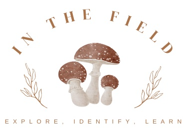

[](https://github.com/In-The-Field/In_The_Field_BE/graphs/contributors)
[](https://github.com/In-The-Field/In_The_Field_BE/forks)
[](https://githuB.com/In-The-Field/In_The_Field_BE/stargazers)
[](https://github.com/In-The-Field/In_The_Field_BEissues)

# In the Field



## About This Project
### Important to Note
This is an SOA app and needs both this repo (back end) AND [ ](https://github.com/In-The-Field/In_The_Field_FE) (front end) in order to be fully functioning.

### Mod 4 Capstone Project
In the Field is a mushroom identification app. Designed for folks looking to explore, learn about, and identify mushrooms. In the Field has the ability for registered users to upload pictures from mushrooms they have found in the wild and get a list of probable matches complete with information about said mushroom. Users also have the ability to create their own field guide of mushrooms they have saved.
                                                  <br><br>
                    
                    
## Purpose

The purpose of the backend for the In the Field app is to support the overall functionality and effectiveness of the platform. Here are some key purposes of the backend in relation to the project:

<b><u>Data management:</u></b> The backend serves as the central hub for storing, organizing, and managing the data associated with potential mushroom matches and data, and user profiles. It provides the necessary infrastructure and databases to efficiently handle the large volume of information generated by the app's users.

<b><u>User-generated content management:</u></b> The backend handles the uploading, storage, and retrieval of user-generated content. It ensures efficient data handling and metadata management. 

<b><u>Community interaction and engagement:</u></b> The backend hopes to supports community-driven features, such as information sharing regarding found mushrooms, locations, uses, etc. Future features would enables users to interact with each other through comments, likes, and replies, fostering a sense of community and encouraging user engagement. The backend would ensures smooth communication and real-time updates within the app, enhancing the overall user experience.

Overall, the purpose of the backend in the In the Field app is to support seamless data management and community engagement. It plays a vital role in ensuring the app's functionality, security, and user satisfaction, ultimately enhancing the experience of those folks who love to get outside and learn about the natural world around them.

## Built With
* 
* 
* 
* 
* 
* 
* 
* 

## Running On
  - Rails 7.0.6
  - Ruby 3.2.2

## <b>Getting Started</b>

To get a local copy, follow these simple instructions

### <b>Installation</b>

1. Fork the Project
2. Clone the repo 
``` 
git clone git@github.com:In-The-Field/In_The_Field_BE.git
```
3. Install the gems
```
bundle install
```
4. Create the database
```
rails db:{create,migrate}
```
5. Add Figaro
```
bundle exec figaro install
```
6. Get API keys from Kindwise <br>
[Kindwise](https://www.kindwise.com/mushroom-id)<br>

7. Add your keys to your `application.yml` like this:
```
KINDWISE_API: <your_api_key_here>
```
8. Create your Feature Branch 
```
git checkout -b feature/AmazingFeature
```
9. Commit your Changes 
```
git commit -m 'Add some AmazingFeature' 
```
10. Push to the Branch 
```
git push origin feature/AmazingFeature
```
11. Open a Pull Request

## Endpoints Used

<div style="overflow: auto; height: 200px;">
  <pre>
    <code>
      POST /api/v1/identification - List of probable matches
      GET /api/v1/identification/:access_token - Detailed description of match
      DELETE /api/v1/identification/:access_token - Remove favorite from field guide
    </code>
  </pre>
</div>

- Response

<div style="overflow: auto; height: 200px;">
  <pre>
    <code>

- List of Probable Matches 
https://inthefieldonrender.com/api/v1/identification

Success Response (200 OK)
Status: 200 OK

{ "data": [
  {
    "id": "558fbb57c985b800",
    "name": "Boletus edulis",
    "probability": 0.5454445
      }
  ]
}

Error Response (400 Bad Request):
Status: 400 Bad Request

{
  "error":
  {
    "code": "BAD_REQUEST",
    "message": "Photo does not have high enough probability of being a mushroom"
  }
}
 

- Detailed Description (of single mushroom)
https://inthefieldonrender.com/api/v1/identification/:access_token

Success Response (200 OK)
Status 200 OK

{
  "data": [
    {
      "id": "558fbb57c985b800",
      "access_token": "VnR9gExfqegyJ27",
      "name": "Boletus edulis",
      "common_names": [
        "Cep",
        "King Bolete",
        "Penny Bun",
        "Porcini"
      ],
      "edibility": "choice",
      "description": {
        "value": "Boletus edulis blah blah blah blah"
      }
    }
  ]
}

Error Response(400 Bad Request)
Status 400 Bad Response

{
  "error":
  {
    "code": "BAD_REQUEST",
    "message": "Access token is not valid"
  }
}


- Delete Mushroom

    </code>
  </pre>
</div>


## Schema
```
  create_table "users", force: :cascade do |t|
    t.string "name"
    t.string "email"
    t.datetime "created_at", null: false
    t.datetime "updated_at", null: false
  end
```

## Contributing  [](https://github.com/CrowRising/PlayPal-FE/issues)
Contributions are what make the open source community such an amazing place to learn, inspire, and create. Any contributions you make are **greatly appreciated**.

If you have a suggestion that would make this better, please fork the repo and create a pull request. You can also simply open an issue with the tag "enhancement".
Don't forget to give the project a star! Thanks again!

## API's Used
[Kindwise](https://www.kindwise.com/mushroom-id)<br>


## Authors
#### BackEnd Team
- Julian Beldotti [ ](https://github.com/JCBeldo) [ ]()
- Sarah Garlock [ ](https://github.com/sarahgarlock) [ ](https://www.linkedin.com/in/sarah-garlock/)
- Matthew William Johnson [ ]( https://github.com/MWMJohnson) [ ]()
- Crow Rising [ ](https://github.com/CrowRising) [ ](https://www.linkedin.com/in/crowrising/)
#### FrontEnd Team
- Elise Jones [ ](https://github.com/Elise-Jones) [ ](https://www.linkedin.com/in/elise-jones-964bb5264/) 
- Joshua Martin [ ](https://github.com/jmartin777) [ ](https://www.linkedin.com/in/joshua-c-martin/)
- Andrea Sorenson [ ](https://github.com/andreasorensen) [ ](https://www.linkedin.com/in/andrea-sorensen-/)


## Planning Tools
- [](https://miro.com/app/board/uXjVMsa-Jz0=/?moveToWidget=3458764562195436996&cot=14)
- [ ](https://github.com/orgs/In-The-Field/projects/2)
